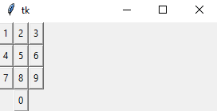

# Layout 

## Grid Layout
- the grid system is relative 
```python
from tkinter import * 

root = Tk()


# num pad 
Button(root, text="1" ,  padx=2 , pady=2).grid(row=0, column=0)
Button(root, text="2" ,  padx=2 , pady=2).grid(row=0, column=1)
Button(root, text="3" ,  padx=2 , pady=2).grid(row=0, column=2)
Button(root, text="4" ,  padx=2 , pady=2).grid(row=1, column=0)
Button(root, text="5" ,  padx=2 , pady=2).grid(row=1, column=1)
Button(root, text="6" ,  padx=2 , pady=2).grid(row=1, column=2)
Button(root, text="7" ,  padx=2 , pady=2).grid(row=2, column=0)
Button(root, text="8" ,  padx=2 , pady=2).grid(row=2, column=1)
Button(root, text="9" ,  padx=2 , pady=2).grid(row=2, column=2)
Button(root, text="0" ,  padx=2 , pady=2).grid(row=3, column=1)


root.mainloop()

```



## pack 

## place 


## 